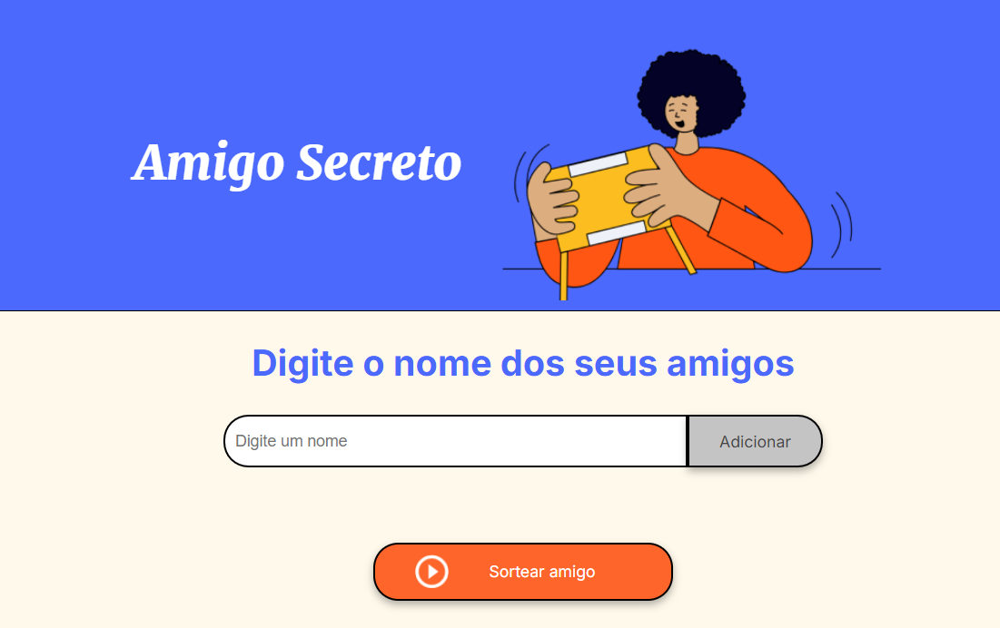

<h1> Projeto Amigo Secreto 🎁</h1>

<h2>🔍 Sobre</h2>

Este é um simples programa para sortear amigos secretos.

<h3>📌 Como usar?</h3>

1- Adicione os nomes dos participantes.

2- Clique em "Sortear Amigo".

3- Nome sorteado será exibido na tela.

## 🛠️ Tecnologias

  
  
  

## 🚀 Acesse o Projeto  
🔗 **Link:** [jogo-do-amigo-secreto.vercel.app](https://jogo-do-amigo-secreto-eight.vercel.app)

## 📸 Preview

